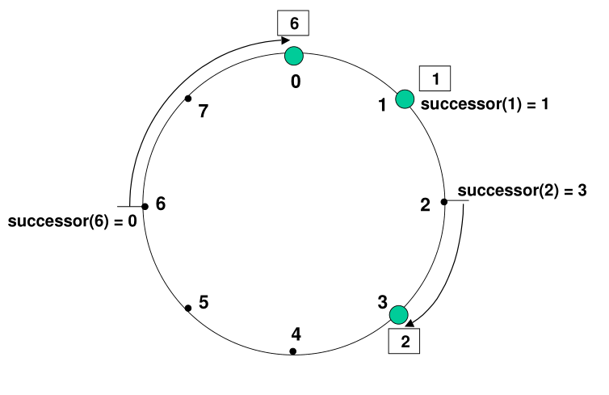
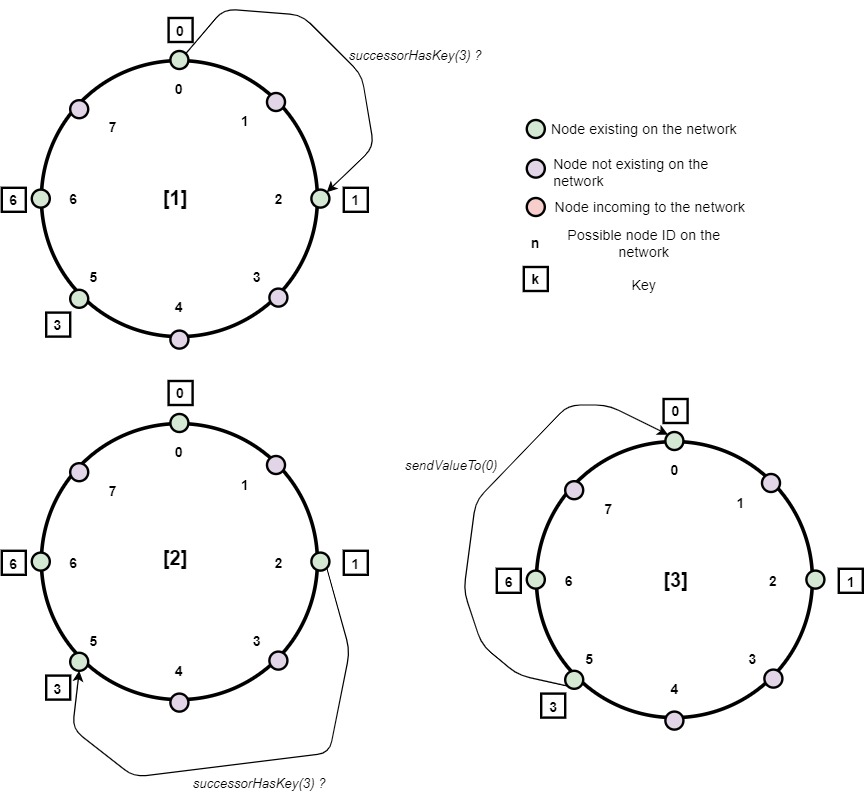

# Circular DHT Implementation

> The implementation is an amalgamation of notes presented [here](./circ_dht.md) and the original paper describing Chord DHT.

> All node IDs are written within parenthesis while the keys are written in square-brackets.

> The nibble-sim simulated in it's current state can only be used on a single computer. The capability of using the same software across different physical devices is lacking but it can be easily incorporated in the set framework.

> `lportNo` refers to listening port number.

### Hash function
- A consistent hash function is used to assign each node and key an *m*-bit identifier. This hash function is **SHA-1**.
- A node's identifier is chosen by hashing the node's IP address&|/port number, while a key identifier is produced by hashing the key.

### Assigning keys to nodes
- Identifiers are ordered in an identifier circle modulo *2^m*.
- Key (*k*) is assigned to the first node whose identifier is equal to or follows *k* in the identifier space. This node is called the successor node of key *k* - denoted as *succesor(k)*.
- If identifiers are represented as a circle of numbers from *0 to (2^m - 1)*, then *succesor(k)* is the first node clockwise from *k*.
- The following example is taken from MIT's original paper on Chord:

    - Numbers in bold (0-7) are possible node IDs.
    - Numbers within the rectangle represent a key to be stored.
    - There are only 3 nodes in the network with network IDs (0), (1), (3).
    - Key [1] will be stored in node (1) because the node with the same node ID exists. Node ID (1) is the successor of [1] => *successor([1]) = 1*.
    - Key [2] would have been stored in node 2, but since no node with such ID exists, the key is associated with node ID closest to 2 and existing on the network. Hence, [2] is stored in node 3 => *successor([2]) = 3*.
    - Similar explanation is valid for assignment of key [6]=> *successor([6]) = 0*.

### Routing information at each node
- Each node knows the IP address&|/port number of it's successor and it's predecessor in the network.
- The above information is stored in the routing table of the node.

### Node joining the network
> **Notation**  
n+ : successor of node n  
n- : predecessor of node n  
n : node to which join request is sent  
n* : node sending the join request to node n
- For a node to join the network, it sends a *join* request (<JOIN-NETWORK\>) to any existing node's IP address&|/port number. It is assumed that there exists an external mechanism through which the IP address&|/port number of a node (n) in the network is known to a new joinee, *n\**. The following details are sent in the <JOIN-NETWORK\>:
    1. Port number on which n* listens

#### After receiving <JOIN-NETWORK\>
After (n) receives the *join* request, the following steps are executed:
1. (n) calculates the hash of the IP address&|/port number of n*.
2. Compares the hash(n*) and hash(n):
- if (hash(n*) > hash(n)):
    - if (hash(n*) < hash(n+)) or (hash(n) > hash(n+)):
        - (n) replies to (n*) with <UPDATE-SUCCESSOR-PREDECESSOR\>:
            - IP address&|/port number of (n) as (n*)'s predecessor
            - IP address&|/port number of (n+) as (n*)'s successor
        - (n) sends <UPDATE-PREDECESSOR\> to (n+) with IP address&|/port number of (n*) as (n+)'s predecessor 
        - (n) updates it's routing table with (n*) as it's successor
    - elif (n+) == (n):
        - (n) replies to (n*) with <UPDATE-SUCCESSOR-PREDECESSOR\>:
            - IP address&|/port number of (n) as (n*)'s predecessor
            - IP address&|/port number of (n) as (n*)'s successor
        - (n) updates it's routing table with (n*) as it's successor
        - if (n-) == (n):
            - (n) updates it's routing table with (n*) as it's predecessor
    - else:
        - (n) sends (n+) <JOIN-NETWORK\> from (n*)
- else (hash(n*) < hash(n)):
    - if (hash(n*) > hash(n-)) or (hash(n-) > hash(n)):
        - (n) replies to (n*) with <UPDATE-SUCCESSOR-PREDECESSOR\>:
            - IP address&|/port number of (n) as (n*)'s successor
            - IP address&|/port number of (n-) as (n*)'s predecessor
        - (n) sends a message to (n-) with IP address&|/port number of (n*) as (n-)'s successor <UPDATE-SUCCESSOR\>
    - elif (n-) == (n):
        - (n) replies to (n*) with <UPDATE-SUCCESSOR-PREDECESSOR\>:
            - IP address&|/port number of (n) as (n*)'s predecessor
            - IP address&|/port number of (n) as (n*)'s successor
        - (n) updates it's routing table with (n*) as it's predecessor
        - if (n+) == (n):
            - (n) updates it's routing table with (n*) as it's successor
    - else:
        - (n) sends (n-) <JOIN-NETWORK\> from (n*)
3. Transferring of keys
    - (n*) can become the successor only for keys that were previously the responsibility of the node immediately following (n*). So, (n) only needs to contact that one node to transfer responsibility for all relevant keys.
    - Hence, only after receiving <UPDATE-SUCCESSOR-PREDECESSOR\>, (n*) sends <TRANSFER-KEYS\> to it's successor.

#### After receiving <TRANSFER-KEYS\>
- Node compares the hash of the keys it has with the hash of the lportNo it receives with the RPC.
    - If the hash of the key is more than or equal to the hash of the lportNo, the key and it's value are sent along with <STORE-KEY\> RPC.
    - Else, nothing is done.

#### After receiving <STORE-KEY\>
- Node compares the hash of the key with it's predecessor:
    - If it is more than it's predecessor, continue to check.
    - Else, send <STORE-KEY\> RPC with the same key to it's predecessor.

- Node compares the hash of the key with it's own hash (hash of it's lportNo):
    - If hash of key is less, then the key is stored in node's own hashtable. Send a <GET-VALUE\> RPC to the node that wishes to store the key.
    - Else, send <STORE-KEY\> RPC with the same key to it's successor.

#### After receiving <UPDATE-PREDECESSOR\> or <UPDATE-SUCCESSOR\> 
- A node update's it's routing table with the node ID and port of with the updated predecessor/successor.

#### After receiving <GET-VALUE\>
- Send (key, value) of the key to the lportNo from <GET-VALUE\> RPC as a part of <STORE-KEY-VALUE\>.
- Delete the (key,value) pair in the node's own hashtable.

#### After receiving <STORE-KEY-VALUE\>
- Store the (key, value) pair in the node's hashtable.

#### Use of <INVALID-RPC\>
- If a node receives an invalid RPC, then the node sends <INVALID-RPC\> with all the information it receives (may be corrupted) to LogServer. 

### Node leaving the network
- Whenever a node (n) leaves the network, keys assigned to (n) will be reassigned to it's successor.
- The routing table of it's predecessor is also updated.

### Resolving query

- The IP address of the node initiating the query also flows with the query request.

### Log server (only for simulation)
- To better understand how communication is happening between the peers in the network, a copy of every message that a peer sends to other peer is sent to the **log server**. The log server is just another terminal acting as a server and receiving a copy of messages and displaying them. Additional functionality to store the logs into a file can be added (depends upon time constraints).
- Each peer in the simulation would be a terminal. Hence, message received or sent by the peer would be displayed on the terminal of each peer.

### FAQs
**Q1.** Why should a node (n) store the IP address of its successor in it's routing table?

**A1.** Given that the nodes in circular DHT are arranged in an identifier circle, if node (n) does not store information about its successor, it won't know where to look-up for keys that are not stored in it. The circular network will not be able to form in this case.

**Q2.** Why should a node (n) also store the IP address of its predecessor?

**A2.** Storing predecessor helps in moving messages around the circle in both the directions.

[Back to home](./Home.md)