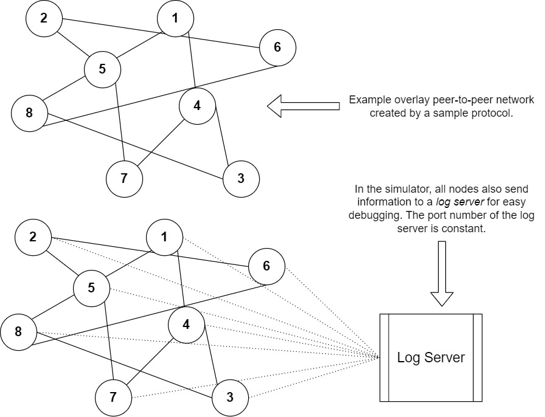

# Simulator structure

There are two main components that make up nibble-sim:
1. P2P protocol
2. Log server

### P2P protocol
- Implemented as a python child class of the parent class *Node*. 
- Each node is an instance of the protocol class.

### Log server
- Responsible for logging the on-goings in the network.

[Back to home](./Home.md)

## Directory details
- The `common` directory contains two python modules implementing the main components of nibble-sim:
    1. `log_server.py`: Manages log messages for debugging and observing the communication in the network.
    2. `node.py`: Contains an abstract class *Node* declaring methods to implement basic RPCs. Every protocol must be implemented as a child class of this class.
- `circular_dht` is an example of P2P protocol implemented on nibble-sim.
    - To append a new protocol to nibble-sim, the files related to the protocol must be placed in a separate and dedicated folder.
- `nibble_sim.py` is the main script initiating nibble-sim.